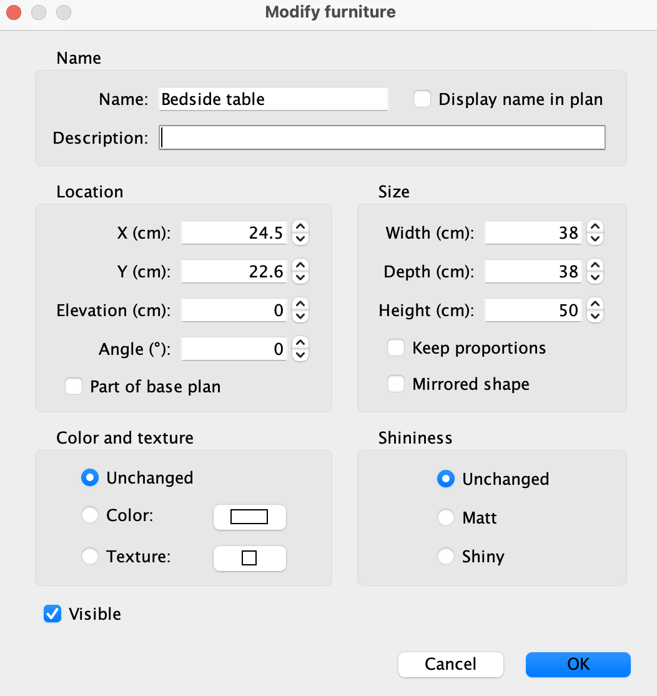
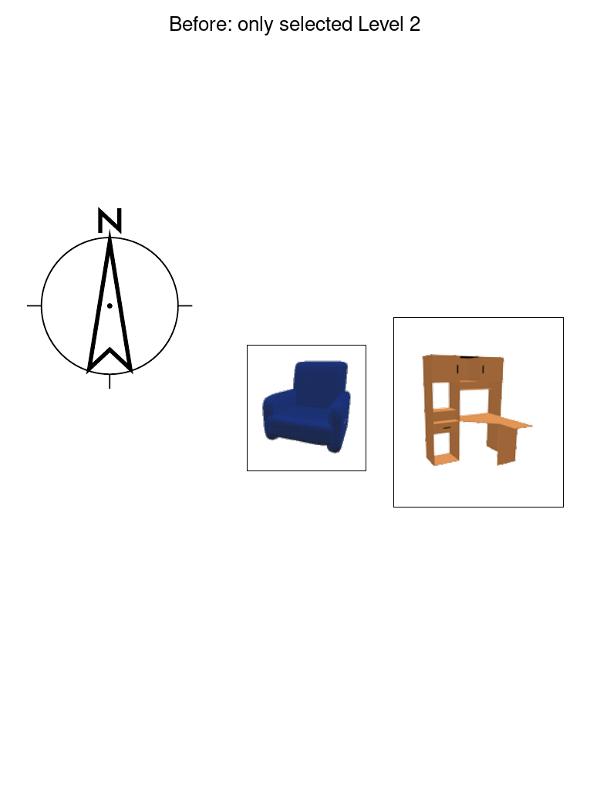
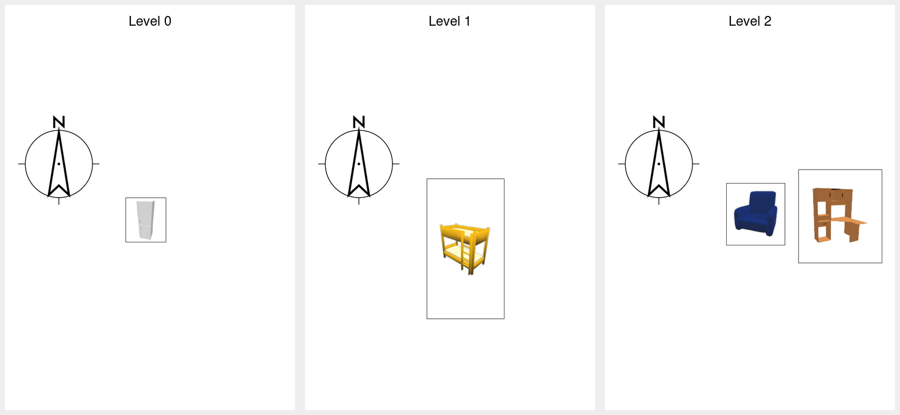

# Internship tasks

Work through the tasks in order. English-only UI updates are sufficient.

As you work, follow the branch-and-merge workflow taught in class. Check
`git status` regularly and commit your work as you make progress.

Do not edit `assignment-tests`. These are the provided acceptance tests run by
`mvn test`, and they will be run when grading your submission.

## GitHub Issues

As part of the maintenance workflow, create a GitHub Issue for each feature
you are assigned in Tasks 2–4.

First, enable Issues in your fork: open **[Settings](../../settings)**, find
**Features**, and select **Issues**. Then use the included
**[Internship task](../../issues/new?template=internship-task.md)** template
to create one issue for each of Tasks 2–4.

Link the relevant commits to each issue. Once you have completed the task,
its tests pass, and its evidence is ready, close the corresponding issue.

Using GitHub Issues is **required**. MarkUs will check that your repository
contains at least three closed issues.

## Acceptance evidence

For every task, place acceptance evidence in `submissions/`. Accepted formats
are PNG, JPG, JPEG, and PDF. The filename must contain the corresponding task
number (`task1`, `task2`, `task3`, or `task4`). Suggested filenames appear
below.

## Generative AI usage

You may use generative AI tools as part of your development workflow.
They can be useful for understanding unfamiliar code, interpreting errors,
or identifying places in the codebase to investigate.
Treat their suggestions as suggestions, not as authoritative answers.

You are responsible for understanding, testing, and being able to explain
any code you submit. Do not submit code that you do not understand.

## Working through the internship

As with joining any established project, you aren't expected to understand
the whole codebase at once. The tasks increase in scope as you go,
but you should also become more comfortable navigating the project and
tracing how existing features work. By the later tasks, you'll need to
investigate multiple parts of the application and determine how they work together.

You do not need to understand the *entire* application before making useful changes to it.

## Task 1 — Get the application running

Your first task is to get the existing application running on your machine.

Fork this repository on GitHub, then follow [QUICK_START.md](QUICK_START.md),
including the clone, build, smoke test, and launch commands. The application
entry point is `SweetHome3D/src/com/eteks/sweethome3d/SweetHome3D.java`.

### Evidence

Show the whole application window running on your
machine.

Suggested filename: `submissions/task1-running.png`.

## Task 2 — Make furniture descriptions editable

Users would like to be able to edit the description of furniture already
placed in a home.

Either open `samples/MultiLevelHome.sh3d` in SweetHome3D,
or create a new home and add a piece of furniture by dragging it
into the plan. The furniture will appear in the furniture table.

Double-click a piece of furniture in the furniture table to open **Modify
furniture**. The Description field is currently disabled. Make that field
editable and ensure a changed description is saved on the furniture object.

| Before | Required result |
| --- | --- |
|  |  |

### Useful places to investigate

The controller already handles saving the value. Look for the method that tells
the view whether each furniture property is editable; the implementation is a
small change, but update any now-inaccurate documentation near it too.

### Evidence

Show the **Modify furniture** dialog with an edited description.

Suggested filename: `submissions/task2-description.png`.

The public test checks that DESCRIPTION is reported as editable.

## Task 3 — Add a Volume column

Users would like to view and sort furniture by **volume**. Add Volume as a
furniture property whose value is calculated as `width * depth * height`.
For this assignment, display it using the application's existing
length-based number formatting.

The completed feature must:

1. show Volume by default for a new home;
2. calculate the value for both catalog and home furniture;
3. allow ascending and descending sorting by volume;
4. offer Volume in both **Furniture > Sort by** and **Furniture > Display
   column**;
5. offer the same choices in the furniture table's context menu; and
6. include the English label and tooltip text for the new Volume controls.

| Before | Required result |
| --- | --- |
|  |  |

Additional reference views:

| Behaviour | Required result |
| --- | --- |
| Correct calculation |  |
| Completed sort/display menus |  |
| Context menu |  |
| Sorted values |  |

### Useful places to investigate

Volume follows the same path through the application as Width, Depth, and
Height. When working in an unfamiliar codebase, tracing an existing, similar
feature is often the fastest way to understand what needs to change. Search
for one of these sortable properties across the model, controller, view,
table renderer, and English resource files.

> IntelliJ tip: Press **Shift twice** to open **Search Everywhere**.
> You can use it to quickly find classes, files, methods,
> fields, and other symbols by name as you trace a feature
> through the codebase.

### Evidence

Show the Volume column populated and one of the menus containing its sort or
display control.

Suggested filename: `submissions/task3-volume.png`.

Provided tests check the calculation, comparator, default column, table header, and menu
action types.

## Task 4 — Print every level

Users working with multi-level homes need printed output that represents the
whole home, not just the level they happen to be viewing.

Open `samples/MultiLevelHome.sh3d` in SweetHome3D. In the starter application, printing a
plan includes only the currently selected level. Change printing so that one
print operation contains:

- a furniture table covering furniture on every viewable level, with a Level
  column so rows are distinguishable; and
- one plan page for each viewable level, in the home's level order.

Printing must restore the level that was selected before printing, including
when a page cannot be rendered. Printing must not change whether
the Level column is visible in the on-screen furniture table.

| Before: selected Level 2 only | Required result: Level 0, 1, and 2 |
| --- | --- |
|  |  |

The full four-page reference output is
[`samples/MultiLevelHomeAfter.pdf`](samples/MultiLevelHomeAfter.pdf): the first
page is the all-level furniture table and the next three pages are the plans.

### Useful places to investigate

- `FurnitureTable` prints the furniture table and applies a furniture filter.
- `PlanComponent` prints the selected plan and decides whether a page exists.
- `HomePrintableComponent` coordinates the printable sections.
- `Home` can change its selected level. Treat that as temporary state and
  restore it reliably.

### Evidence

Show the print-preview page count or thumbnails,
or include a PDF of the printed output (i.e., print to PDF).

Suggested filenames: `submissions/task4-all-levels.png` or
`submissions/task4-all-levels.pdf`.

The provided test checks that each plan page
exists and that the selected level is restored.
The furniture-table content and visual output are not
tested by the provided tests, so make sure to confirm those manually.

## Final checklist

Before submitting, make sure that:

- all provided tests pass;
- Tasks 2–4 each have a closed GitHub Issue with the relevant commits linked;
- your acceptance evidence for Tasks 1–4 is committed under `submissions/`;
- all of your work has been pushed to your GitHub fork; and
- your working tree contains no changes you intended to submit but forgot to
  commit.

A Python script is provided to check that the expected submission files are
present. You can run it locally, and the MarkUs self-tests will run the same
check.

If you have these tools configured to run from the terminal,
you can use the following as a quick final check:

```sh
mvn clean test
python3 test_submission.py
git status --short
```
