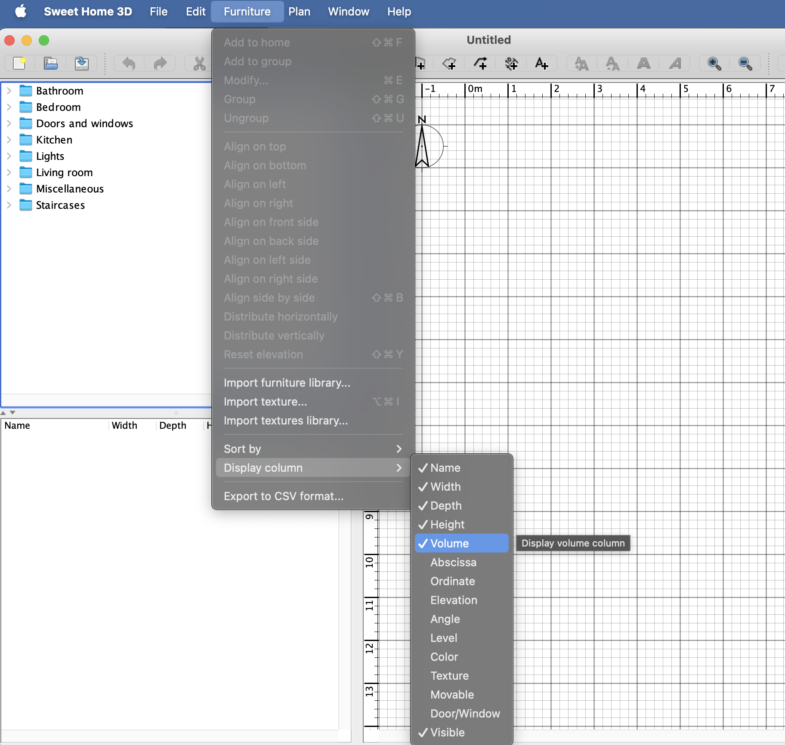

# Internship tasks

Work through the tasks in order. English-only UI updates are sufficient. Do
not edit `assignment-tests`; these are the public acceptance tests used by
`mvn test` and may be supplemented by hidden tests during grading.

## Task 1 — Get the application running

Follow [QUICK_START.md](QUICK_START.md), including the build, smoke test, and
launch commands. The application entry point is
`SweetHome3D/src/com/eteks/sweethome3d/SweetHome3D.java`.

Acceptance evidence: commit `submissions/task1-running.png`, showing the whole
application window running on your machine.

## Task 2 — Make furniture descriptions editable

Double-click a piece of furniture in the lower-left table to open **Modify
furniture**. The Description field is currently disabled. Make that field
editable and ensure a changed description is saved on the furniture object.

| Before | Required result |
| --- | --- |
|  |  |

The controller already handles saving the value. Look for the method that tells
the view whether each furniture property is editable; the implementation is a
small change, but update any now-inaccurate documentation near it too.

Acceptance evidence: commit `submissions/task2-description.png`, showing an
edited description in the dialog. The public test checks that DESCRIPTION is
reported as editable.

## Task 3 — Add a Volume column

Add Volume as a furniture property. Its value is `width * depth * height` and
uses the application's existing length-based number formatting.

The completed feature must:

1. show Volume by default for a new home;
2. calculate the value for both catalog and home furniture;
3. allow ascending and descending sorting by volume;
4. offer Volume in both **Furniture > Sort by** and **Furniture > Display
   column**;
5. offer the same choices in the furniture table's context menu; and
6. include the English label and tooltip text used by those controls.

| Before | Required result |
| --- | --- |
|  |  |

Additional reference views:

| Behaviour | Required result |
| --- | --- |
| Correct calculation |  |
| Completed sort/display menus |  |
| Required menu locations |  |
| Context menu |  |
| Sorted values |  |

Volume follows the same path through the application as Width, Depth, and
Height. Searching for an existing sortable property across model, controller,
view, table renderer, and English resource files is a useful way to understand
that path.

Acceptance evidence: commit `submissions/task3-volume.png`, showing the Volume
column populated and one of its sort/display menus. Public tests check the
calculation, comparator, default column, table header, and menu action types.

## Task 4 — Print every level

Open `samples/MultiLevelHome.sh3d`. In the starter, printing a plan uses only
the currently selected level. Change printing so one print operation contains:

- a furniture table covering furniture on every viewable level, with a Level
  column so rows are distinguishable; and
- one plan page for each level, in the home's level order.

Printing must restore the level that was selected before printing, including
when a page cannot be rendered. It must not permanently add the Level column to
the on-screen furniture table when the user had hidden it.

| Before: selected Level 2 only | Required result: Level 0, 1, and 2 |
| --- | --- |
|  |  |

The full four-page reference output is
[`samples/MultiLevelHomeAfter.pdf`](samples/MultiLevelHomeAfter.pdf): the first
page is the all-level furniture table and the next three pages are the plans.

Useful places to investigate:

- `FurnitureTable` prints the furniture table and applies a furniture filter.
- `PlanComponent` prints the selected plan and decides whether a page exists.
- `HomePrintableComponent` coordinates the printable sections.
- `Home` can change its selected level. Treat that as temporary state and
  restore it reliably.

Acceptance evidence: commit either `submissions/task4-all-levels.png` showing
the print-preview page count/thumbnails, or
`submissions/task4-all-levels.pdf` containing the output. The public test checks
that each plan page exists and that the selected level is restored. The
furniture-table content and visual output are checked manually.

## Final checklist

Before submitting:

```sh
mvn clean test
python3 test_submission.py
git status --short
```

Review `git status`, then commit only your source changes and the required
evidence files.
