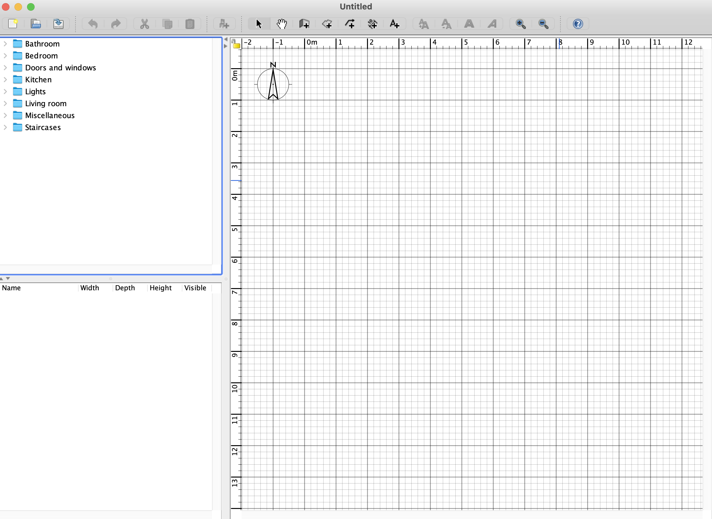
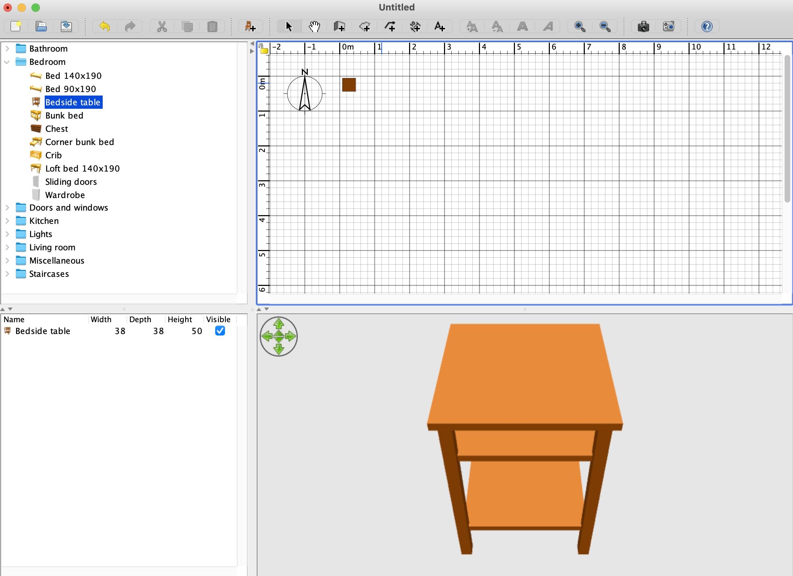
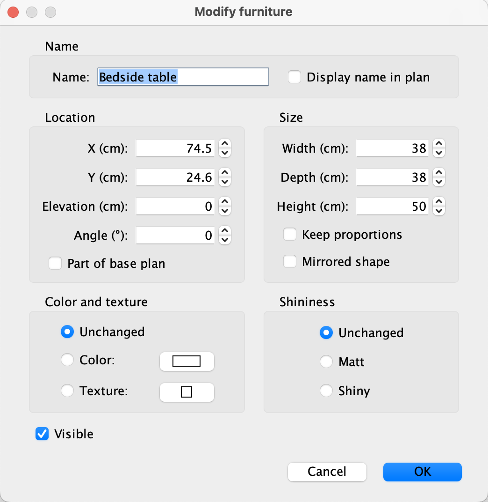
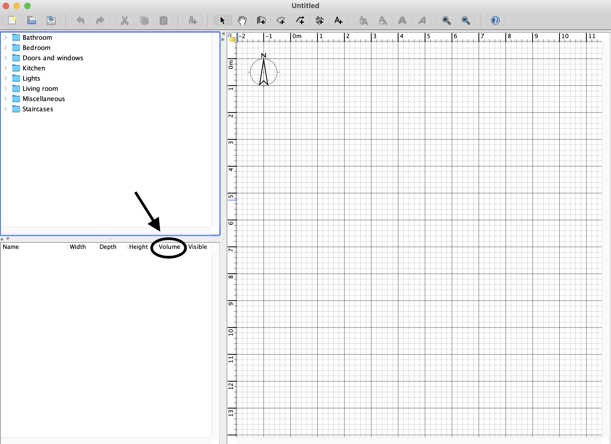
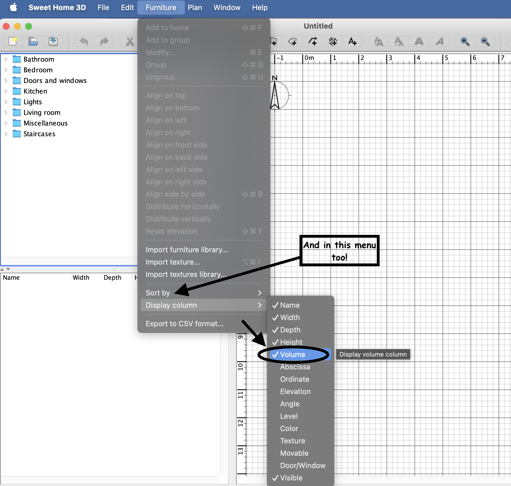
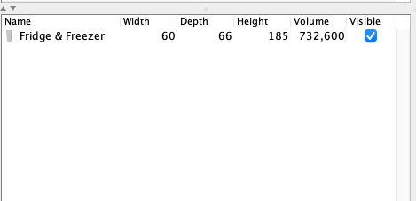
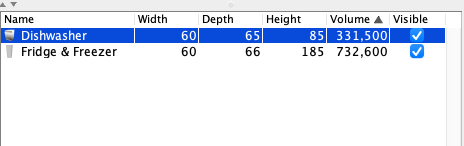
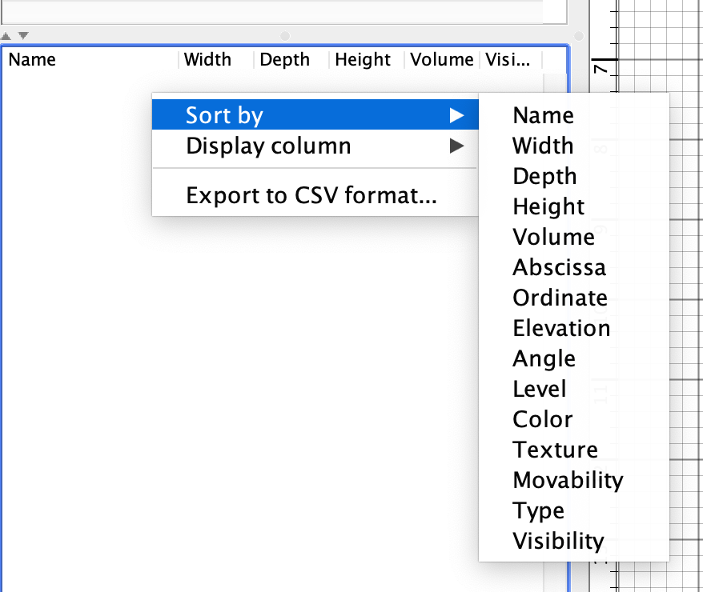

TODO: add screenshots of the before and after
      views for the various tasks...

Hi!

Welcome to the development team!

To get you familiar with our product,
we have a few tasks that we give to all of our new interns.

# IMPORTANT

If you encounter issues completing any of the tasks below:

1. Ask for targeted help on Piazza or in an office hour.
2. If it is an issue with the program not running on your machine despite
   your best efforts, please make use of the available lab machines to complete
   the tasks. Remote access options are available;
   see the course Quercus for details.

> Note: the program supports multiple languages, but for our purposes
> it is enough to only support English in your updates to the code.

# Task 1

Make sure that you have a local copy that you are able to run:

`SweetHome3D` (`SweetHome3D/src/com/eteks/sweethome3d/SweetHome3D.java`)
is the file that contains the main method for the whole application.

`PrintTest` (`SweetHome3D/test/com/eteks/sweethome3d/junit/PrintTest.java`)
is one of the test files that you will need to work with.

Note: you may encounter some issues with missing requirements.
Carefully read the error messages and ask for help as needed.

- [ ] Commit a screenshot of the running application to your repo on MarkUs;
     the file name must include "task1" in the name.

> TODO have to check to ensure that 3D is properly disabled
> TODO do we want to set things up with Maven here?

Upon launch, you should see something similar to:

The software allows you to design floor plans and place furniture:

- The top left is the catalog of furniture.

- The bottom left lists the furniture currently placed.

- The right shows the floor plan.

> Note: you can also enable a 3D mode, but that has been disabled for the purposes
> of our work here. Feel free to try it out though if interested:
> 
> The bottom right shows the 3D view of the floor plan.

# Task 2

A "New" Feature: Adding descriptions for pieces of furniture.

In the GUI, you can double-click on a piece of furniture or its name in the furniture table
to open the "Modify furniture" dialog.

| Before                                                 | After                                                       |
|--------------------------------------------------------|-------------------------------------------------------------|
|  |  |

Hint: once you find the right place in the code,
this one is somewhat surprisingly just a single line change in the code!

- [ ] Commit another screenshot of this working, include "task2" in the file name.

> TODO make an automatic test of some kind for this one?

# Task 3

New Feature: Adding a volume column to the furniture table

The table below summarizes what the program will look like once you have added
the volume calculation and column to the program.

| Description                                                                    | Appearance Once Implemented                                 |
|--------------------------------------------------------------------------------|-------------------------------------------------------------|
| When you open SweetHome3D, a volume column should be present                   |     |
| The menu options for sorting and displaying columns should both include volume |  |
| The volume should be calculated as the product of the width, depth, and height |                 |
| The user should be able to sort by the volume.                                 |                     |
| The options to sort and display by volume should also appear in the menu that appears when right-clicking the furniture table in the GUI |         |

Note: unlike the previous change, this one will require changes across
many files to get it fully implemented in the program.

> Advice: Volume is similar to width, depth, and height. If you can find all the places
> where they are mentioned, then that should help you identify where you need to add code.

Hint: TODO add some hints about specific constants to search for in the files?

> TODO ensure that we exhaustively catch everything in the program that
> needs to change to fully update this

- [ ] Commit your code on MarkUs.
- [ ] Commit another screenshot of this working, include "task3" in the file name.

> TODO decide what is best for them to submit here... decide on autotests too...
> TODO for the tests, look into running them on MarkUs or if we need to
>      run the GUI-related ones locally instead... note, it doesn't look
>      like running in headless mode is an option, but maybe there is something
>      that was overlooked...

# Task 4

New Feature: Printing all levels instead of only the currently active layer

You are provided a sample project, `samples/MultiLevelHome.sh3d` which
you should be able to open.

See `samples/MultiLevelBefore_Level2Only.pdf` for what it originally should
look like when you print with Level 2 open on the right side of the editor
and select to print to PDF.

See `samples/MultiLevelHomeAfter.pdf` for what it should print after you
make your changes.

> Note: this will likely be much trickier than the previous tasks, as
> it requires you to dig into where and how the printing is actually done. It turns
> out that it is a bit complicated, so we've included some bits of advice for if
> you get stuck.

Hint 1

The FurnitureTable class is what prints/displays the table of furniture.

Hint 2

The PlanComponent class is what prints/displays the currently selected level's plan in the code.

Hint 3

The HomePrintableComponent class also has a print method; it makes use of a "FurnitureFilter"
to filter out furniture that isn't in the currently selected level.

Hint 4

Given a Home object, one can set the currently selected level. This might be
useful when printing each level; just remember to reset the currently selected level when you are done! 

> TODO decide on the exact framing, as we actually currently implemented this
>      as a change to the existing functionality rather than as something new...

- [ ] Commit your code on MarkUs.

- [ ] Commit another screenshot of this working, include "task4" in the file name.

# Task 5

Adding additional tests for your new features

TODO decide if we want them to do this or not...?